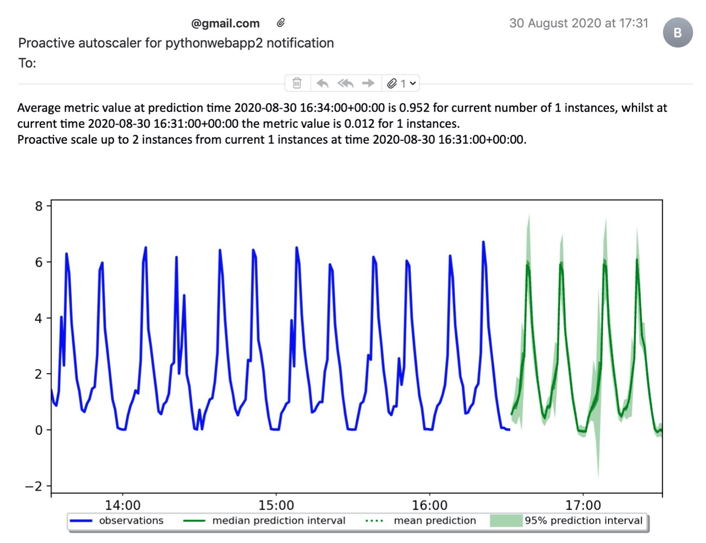
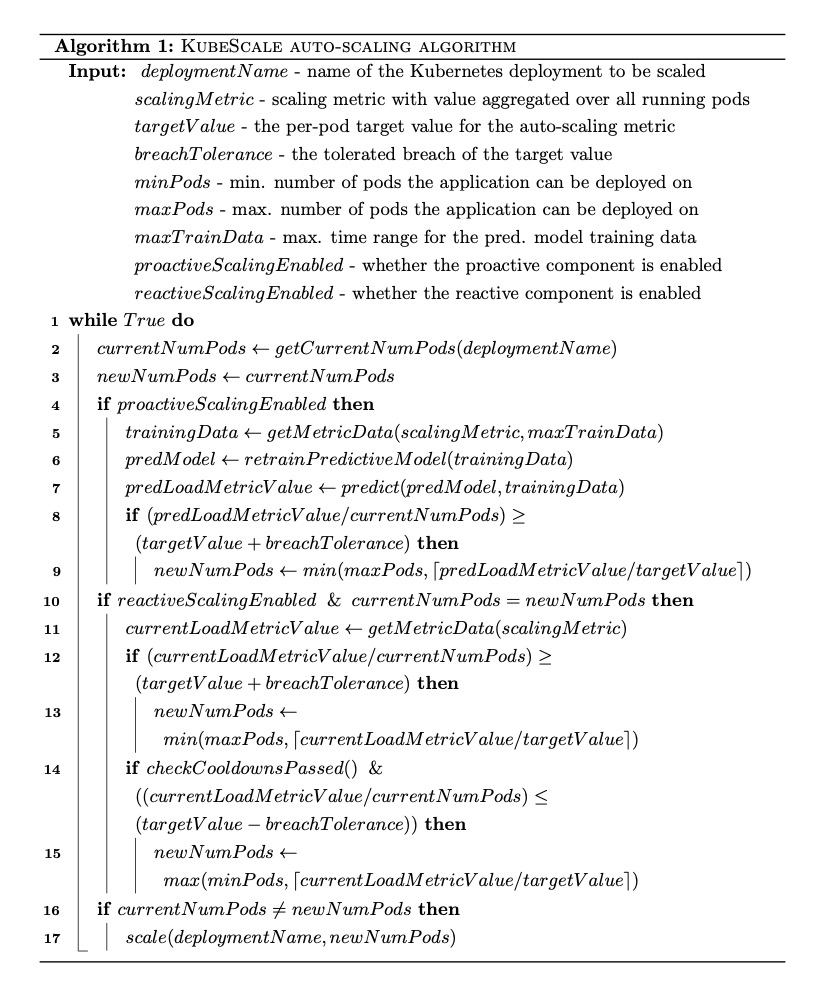

KubeScale
------------------

- [Introduction](#intro)
- [Why KubeScale instead of the Kubernetes HPA?](#hpa)
- [Alerts of scaling decisions with explanation](#prediction-alerts)
- [Configuration explained](#config)
- [High level KubeScale algorithm](#high-level)

### Introduction <a name="intro"></a>

KubeScale is a hybrid auto-scaler primarily focused on horizontally scaling containerised applications deployed on Kubernetes.
It automatically scales deployments on Kubernetes by <b>predicting</b> the future workload and adjusting the resources beforehand.
The workload prediction is done using a [Deep Autoregressive Recurrent Networks](https://arxiv.org/abs/1704.04110) (implemented by GluonTS).

Some of the problems solved by the KubeScale auto-scaler are:
- how to minimise the wasting of computing resources and avoid resource over-provisioning
- how to maximise the performance of the application and avoid resource under-provisioning
- how to determine when to scale up and scale down
- how much to scale the resources
- how to anticipate rising or falling demand for computing resources
- ...

Existing metrics sources are:
- Requests per second
- CPU usage

To integrate a new source of metrics use the simple MetricSource interface.
You should choose metrics that are likely to present the overall workload on the application.

### Why KubeScale instead of the Kubernetes HPA?  <a name="hpa"></a>

Compared to the native Kubernetes horizontal pod auto-scaler, KubeScale:
- supports Prometheus as metrics source allowing you to avoid complicated integration with the metrics server
- predicts future metric values using time-series optimised deep recurrent neural networks
- allows greater fine tuning and control

### KubeScale email alerts <a name="prediction-alerts"></a>

KubeScale sends alerts regularly 
An example of an alert the KubeScale auto-scaler sends:


### Configuration explained <a name="config"></a>

KubeScale is very configurable and extensive, below is the default configuration explained.
The most important parameter for tuning is the scaling metric that is going to be used for auto-scaling and the target value for that metric.
The target value for an auto-scaling metric presents a trade-off between resource utilisation and quality of service. 
Targeting a lower resource usage ensures resources are sufficiently over-provisioned to reduce the likelihood that the quality of service deteriorates when there are sudden demand bursts.

```yaml
# namespace and service name of Prometheus - we get the REST API host/port using this information
prometheus_namespace: cm
prometheus_svc_name: prometheus-release-server
# namespace and service name of the prometheus push gateway - used for storing the state of the autoscaler
pushgateway_namespace: cm
pushgateway_svc_name: prometheus-release-pushgateway
# email address of the person receiving the scaling events
notification_email_receiver: abc@gmail.com

# used to identify the kubernetes deployment that has to be scaled
kubernetes:
  # name of the space in which the resource is
  namespace: default
  # name of the deployment
  deployment: pythonwebapp
  # in case the resources pods have two containers, what is the name of one of the containers
  container: pythonwebapp

# these configurations alter the behaviour of the auto-scaler
strategy:
  # whether to scale based on reactive indications
  # recommended to enable together with proactive mode to make the auto-scaler hybrid
  reactive_scaling_enabled: true
  # whether to scale based on proactive indications
  # recommended to enable together with reactive mode to make the auto-scaler hybrid
  proactive_scaling_enabled: true
  # whether to down scale based on proactive indications -> usually it doesn't make sense to downscale if you expect
  # that in eg. 10 minutes the
  proactive_downscaling_enabled: false
  # whether to only email forecasts and not actually scale the number of instances
  proactive_mode_forecast_only: false
  # whether to delay making proactive decision until min_train_data_history_hours of time passes.
  # for cases where you expect that the pattern changed so much that the there isn't enough appropriate training data
  delay_proactive_mode_by_min_train_data_history: false
  # how often to run the control loop evaluation method, in seconds, minimum is 30 due to granularity of metrics
  eval_time_interval_sec: 30
  # minimum number of instances (pods) for that deployment
  min_instances: 1
  # maximum number of instances (pods) for that deployment
  max_instances: 15
  # how long to wait before a downscaling decision after any scaling decision
  downscale_cooldown_period_min: 1
  # how long to wait before a downscaling decision after a scaling up decision.
  # usually this is set to a higher value than 'downscale_cooldown_period_min' to avoid the reactive component
  # interfering with the proactive component that increases the resources ahead of time (as defined with the preempt_period_min parameter)
  downscale_after_predictive_scaleup_cooldown_period_min: 3
  # the period you want to make a scaling decision for
  # eg. now you want to make a decision on what number of instances you should have in 30 seconds
  preempt_period_min: 3
  # maximum percentage that the auto-scaler can downscale at once eg. from 10 to 5 nodes
  downscale_max_percentage: 20

forecasting:
  # how often to forecast future values of the metric values - expensive operation due to having to train a predictive model (measured in minutes)
  forecast_creation_interval_mins: 30
  # for how long in future to forecast (measured in minutes). depends primarily on the type of workload and datasets
  forecast_period_mins: 60

metrics:
  # currently supported metrics (defined as per pod values) are:
  #    a) requests_per_second - number of requests per second handled by each instance
  #    b) cpu_usage - utilisation of the allowed CPU resources (as a percentage - so from 0 to 1)
  load_metric_name: requests_per_second # must be same as scaling metric
  # target value of the load metric for each instance
  scaling_metric_target_value: 30
  # if the threshold is breached on the other side by less than this amount, don't do anything
  threshold_breach_tolerance: 5
  # how much past data (metrics) have to be gathered (in seconds) - 43200 means 12 hours, 1 hour is 3600
  min_train_data_history_hours: 2
  # don't use more than this data for training - 604,800 means 7 days (3600 * 24 * 7). Max value is 14 days
  max_train_data_history_hours: 8
  # resolution of metrics - ie. when getting a time-series of metrics
  # for which interval to get each of the metrics in minutes, minimal value is 1
  # Gluon TS models don't support less than a 1 minute frequency
  step_size_mins: 1

custom_params:
  # necessary for the requests_per_second metric source to be able to get the relevant metric from the Envoy load balancer
  # use it to similarly pass the configuration for other metric sources
  cluster_name: pythonwebapp
```

### High level KubeScale algorithm <a name="high-level"></a>

The high level algorithm behind KubeScale is the following:


