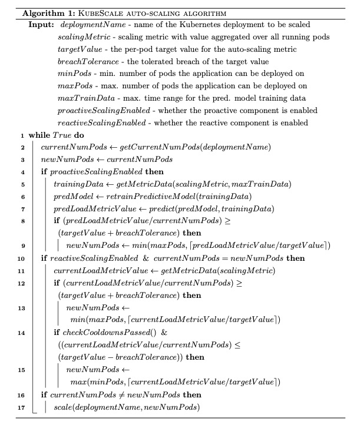

KubeScale
------------------

1. [Introduction](#intro)
2. [Why KubeScale instead of the Kubernetes HPA?](#hpa)
3. [Third Example](#third-example)
4. [Fourth Example](#fourth-examplehttpwwwfourthexamplecom)

###Introduction <a name="intro"></a>

KubeScale is a hybrid auto-scaler primarily focused on horizontally scaling containerised applications deployed on Kubernetes.
It automatically scales deployments on Kubernetes by <b>predicting</b> the future workload and adjusting the resources beforehand.
The workload prediction is done using a Deep auto-regressive estimator 

Some of the problems solved by the KubeScale auto-scaler are:
- how to determine when to scale up
- how to determine when to scale down
- how much to scale the resources
- ...

Existing metrics sources are:
- Requests per second
- CPU usage

To integrate a new source of metrics use the simple MetricSource interface.
You should choose metrics that are likely to present the overall workload on the application.

### Why KubeScale instead of the Kubernetes HPA?  <a name="hpa"></a>

Compared to the native Kubernetes horizontal pod auto-scaler, KubeScale:
- supports Prometheus as metrics source allowing you to avoid complicated integration with the metrics server
-   
- 

### High level KubeScale algorithm

The high level algorithm behind KubeScale is the following: 


### KubeScale email alerts

KubeScale sends alerts regularly 
An example of an alert the KubeScale auto-scaler sends:


### Configuration

KubeScale is very configurable and extensive, below is the default configuration explained:

```yaml
# the location of prometheus REST API
prometheus_namespace: cm
prometheus_svc_name: prometheus-release-server
# the location of the prometheus push gateway - used for storing the state of the autoscaler (ie. which mode it's running in and etc...)
pushgateway_namespace: cm
pushgateway_svc_name: prometheus-release-pushgateway

notification_email_receiver: abc@gmail.com
kubernetes:
  # name of the space in which the resource is
  namespace: default
  # name of the deployment
  deployment: pythonwebapp
  # in case the resources pods have two containers, what is the name of one of the containers
  container: pythonwebapp

strategy:
  # whether to scale based on reactive indications
  reactive_scaling_enabled: true
  # whether to scale based on proactive indications
  proactive_scaling_enabled: true
  # whether to down scale based on proactive indications -> usually it doesn't make sense to downscale if you expect
  # that in eg. 10 minutes the
  proactive_downscaling_enabled: false
  # whether to only email forecasts
  proactive_mode_forecast_only: false
  # whether to delay making proactive decision until min_train_data_history_hours of time passes
  # useful for cases where you expect that the pattern changed so much that the potentially available
  #  training data will be missing
  delay_proactive_mode_by_min_train_data_history: false
  # how often to run the control loop evaluation method, in seconds, min is 30
  eval_time_interval_sec: 30
  # minimum number of instances (pods) for that deployment
  min_instances: 1
  # maximum number of instances (pods) for that deployment
  max_instances: 15
  # how long to wait before a downscaling decision
  downscale_cooldown_period_min: 1
  # how long to wait before a downscaling decision
  downscale_after_predictive_scaleup_cooldown_period_min: 3
  # the period you want to make a scaling decision for
  # eg. now you want to make a decision on what number of instances you should have in 30 seconds
  preempt_period_min: 3
  # maximum percentage that the auto-scaler can downscale at once eg. from 10 to 5 nodes
  downscale_max_percentage: 20

forecasting:
  # how often to forecast future values of the metric, in seconds (eg. 1800s = 30min)
  forecast_creation_interval_mins: 30
  # for how long in future to forecast
  forecast_period_mins: 60

metrics:
  # currently supported metrics (defined as per pod values) are:
  #    a) requests_per_second - number of requests per second handled by each instance
  #    b) cpu_usage - utilisation of the allowed CPU resources (as a percentage - so from 0 to 1)
  load_metric_name: requests_per_second # must be same as scaling metric
  # target value of the load metric for each instance
  scaling_metric_target_value: 30
  # if the threshold is breached on the other side by less than this amount, don't do anything
  threshold_breach_tolerance: 5
  # how much past data (metrics) have to be gathered (in seconds) - 43200 means 12 hours, 1 hour is 3600
  min_train_data_history_hours: 2
  # don't use more than this data for training - 604,800 means 7 days (3600 * 24 * 7). Max value is 14 days
  max_train_data_history_hours: 8
  # resolution of metrics - ie. when getting a time-series of metrics
  # for which interval to get each of the metrics in minutes, minimal value is 1
  # Gluon TS doesn't support less than 1 minute frequency
  step_size_mins: 1

custom_params:
  # necessary for the requests_per_second metric source to be able to get the relevant metric from the Envoy load balancer
  cluster_name: pythonwebapp
```